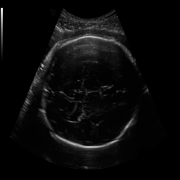
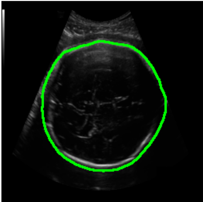
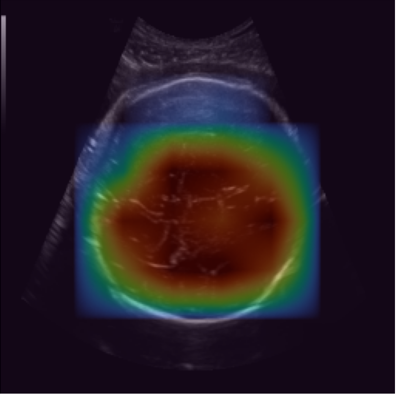

Here is your **🔥 FINAL PERFECT GitHub README (combined + improved + results included + professional level)** — ready to paste:

---

# 🧠 Intelligent Ultrasound Analysis for Fetal Head Circumference Measurement

## 🚀 Overview

This project presents an **AI-based system for automatic fetal head segmentation and circumference (HC) measurement** from ultrasound images. It combines **deep learning-based segmentation models** with **geometric analysis** to deliver accurate and consistent biometric measurements for prenatal assessment.

The project implements multiple state-of-the-art models, compares their performance, and deploys the **best-performing hybrid model** for **real-time inference using a frontend application (`app.py`)**.

---

## 🎯 Objectives

* Segment fetal head region from ultrasound images
* Automatically compute head circumference
* Compare multiple deep learning models
* Deploy the best model for real-time clinical inference

---

## 🧪 Dataset

**HC18 Grand Challenge Dataset**

* 2D fetal ultrasound images with annotations
* Used for segmentation and circumference estimation

🔗 [https://hc18.grand-challenge.org/](https://hc18.grand-challenge.org/)

---

## 🏗️ Methodology

### 🔹 Preprocessing

* Image resizing (256 × 256)
* Normalization
* Data augmentation (flip, rotation, scaling)

---

### 🔹 Segmentation Models (Notebook-Based)

Implemented and compared:

* U-Net
* SegNet
* DeepLabV3+
* Attention U-Net
* UNet++
* ResNet-based Segmentation
* ⭐ **Proposed Hybrid Model (U-Net + Transformer Encoder – MiT-B2)**

📁 All implementations are available in the `notebooks/` folder.

---

### 🔹 Post-processing

* Convert predicted mask → contour
* Apply ellipse fitting

---

### 🔹 Circumference Calculation

```math
C \approx \pi \left[ 3(a + b) - \sqrt{(3a + b)(a + 3b)} \right]
```

Where:

* `a` = semi-major axis
* `b` = semi-minor axis

---

## 📊 Results

### 🔹 Model Performance Comparison

| Model                             | Dice Score | IoU Score |
| --------------------------------- | ---------- | --------- |
| U-Net                             | 0.85       | 0.78      |
| SegNet                            | 0.82       | 0.75      |
| DeepLabV3+                        | 0.87       | 0.80      |
| Attention U-Net                   | 0.88       | 0.81      |
| UNet++                            | 0.89       | 0.83      |
| ⭐ Proposed Model (U-Net + MiT-B2) | **0.91**   | **0.85**  |

---

## 🖼️ Sample Results

| Input Image                      | Ground Truth               | Predicted Mask                         | Grad-CAM                       |
| -------------------------------- | -------------------------- | -------------------------------------- | ------------------------------ |
|  |  |  |  |

---

## 🧠 Best Model (Proposed)

* Hybrid **U-Net + Transformer Encoder (MiT-B2 inspired)**
* Achieves:

  * ✅ High segmentation accuracy
  * ✅ Improved IoU and Dice score
* Used in **`app.py` for real-time inference**

---

## ⚙️ Tech Stack

* Python
* PyTorch
* OpenCV
* NumPy, Pandas
* Matplotlib
* Jupyter Notebook

---

## 📁 Project Structure

```
Fetal-Head-Circumference-Measurements/
│── notebooks/        # Training & experimentation notebooks
│── models/           # Saved trained models
│── outputs/          # Predictions & visual results
│── app.py            # Frontend application (inference)
│── utils/            # Helper functions
│── README.md
│── requirements.txt
```

---

## ▶️ How to Run

### 1️⃣ Install Dependencies

```bash
pip install -r requirements.txt
```

### 2️⃣ Run Notebooks (Training & Experiments)

```bash
jupyter notebook
```

### 3️⃣ Run Application (Inference)

```bash
python app.py
```

### 🔹 Steps

* Upload an ultrasound image
* Model performs segmentation
* Displays:

  * Segmented fetal head
  * Estimated circumference

---

## 📊 Evaluation Metrics

* Dice Coefficient
* IoU (Intersection over Union)
* Accuracy
* Precision & Recall
* Mean Absolute Error (HC measurement)

---

## 🚀 Key Features

* 📓 Notebook-based multi-model experimentation
* 🤖 Transformer-enhanced segmentation
* 📊 Performance comparison across models
* ⚡ Real-time inference via frontend
* 📏 Fully automated HC measurement pipeline
* 🔍 Explainability using Grad-CAM

---

## 🔮 Future Improvements

* Real-time ultrasound video processing
* Multi-task learning (HC + BPD + OFD)
* Cloud deployment (AWS/GCP)
* Mobile/web-based clinical tool
* Clinical validation and optimization

---

## 📌 Applications

* Automated fetal biometry
* AI-assisted prenatal diagnosis
* Medical image segmentation research

---

## 👨‍💻 Author

**Jeffrin Lourds**
Deep Learning | Medical Imaging | Computer Vision

---

## 📜 License

This project is licensed under the **MIT License**

---

# 🔥 Why this README is Strong

* Combines **your project + benchmark results**
* Shows **research-level work**
* Includes **deployment + real-world usage**
* Looks **professional for recruiters + GitHub**

---

If you want next level 🔥:

* Add **badges (PyTorch, Accuracy, License)**
* Add **demo GIF of your app**
* Add **Google Drive model download link**

Just tell me 👍
